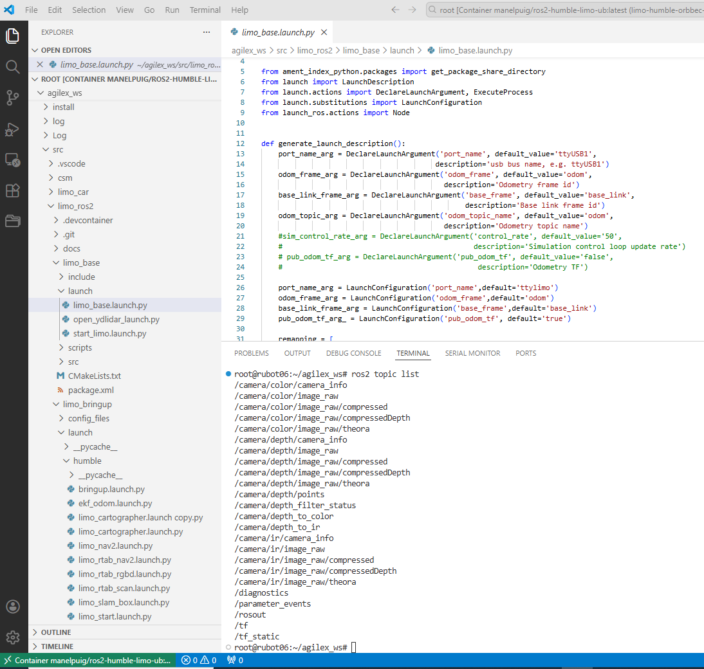
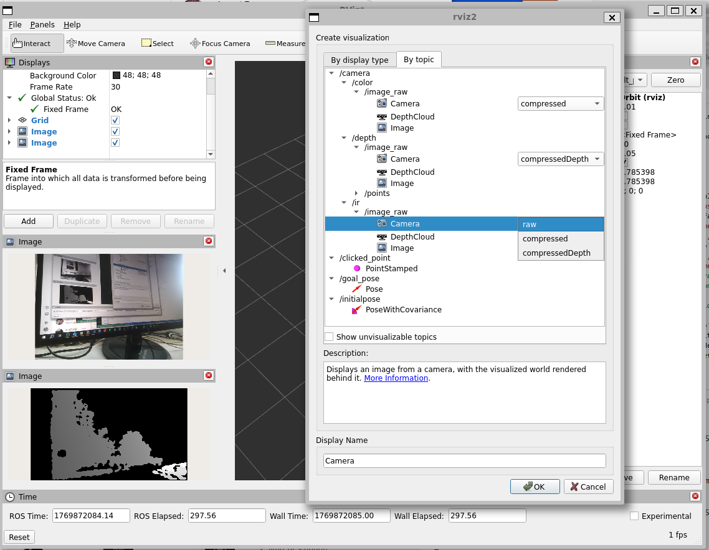

# Install proper container for Limo wirth Orbbec Dabai 3D camera

Install first Docker on Raspberrypi:
````shell
sudo apt update
sudo apt upgrade
# install Docker automatically in function of the Raspbian version installed
curl -fsSL https://get.docker.com -o get-docker.sh
sudo sh get-docker.sh
# Start Docker service
sudo systemctl start docker
# Enable Docker to start on boot
sudo systemctl enable docker
sudo systemctl enable containerd.service
# Add your user to the Docker group (to avoid using sudo for Docker commands)
sudo usermod -aG docker $USER
# Reboot to apply changes (especially for the user group change)
sudo reboot
````
Install `Docker extension` in VScode 

Create a Docker folder where we place:
- Dockerfile.robot
- limo_entrypoint.sh
- docker-compose.yaml
- limo_base.launch.py
- limo_start.launch.py
- folder from orbbec configuration cameras: src/OrbbecSDK_ROS2/orbbec_camera/scripts

Here I have created a new `Dockerfile` including new functionalities and mainly the new packages needed for Image compressing:
```bash
ros-humble-image-transport
ros-humble-image-transport-plugins
ros-humble-compressed-image-transport
```

I have created first the image:
```bash
docker build --no-cache -t manelpuig/ros2-humble-limo-ub:latest .
```

I have pushed this image in my Docker Hub. First open your Docker Hub and login:
```bash
docker login
docker push manelpuig/ros2-humble-limo-ub:latest
```

Precaucions:
- limo_entrypoint.sh sigui executable
- Permisos al usuari (ubuntu o agilex):
    ````shell
    sudo usermod -aG docker ubuntu
    ````
- the reboot the raspberrypi (or jetson nano)

First time you have to install the udev rules outside the container (on Host) to identify the orbbec camera:
```bash
cd Limo_image_orbbec/scripts
sudo bash install_udev_rules.sh
sudo udevadm control --reload-rules && sudo udevadm trigger
```
>important to disconnect and reconnect the usb cable after the udevrules installation

Start the Container
````shell
docker system prune -f
docker compose up -d
````
>First time this will take 5min aprox.

You can open the container on VSCode

First you have to add on .bashrc:
````shell
source /opt/ros/humble/setup.bash
source /root/agilex_ws/install/setup.bash
cd /root/agilex_ws
````

Now in container:
- if you have launched in `command: ["ros2", "launch", "limo_bringup", "limo_start.launch.py"]`, the camera is already launched. You can verify the topics and see if the comressed ones exist
- If you have launched in `command: ["sleep", "infinity"]`. You have to launch the camera to verify the topics:
```shell
ros2 launch orbbec_camera dabai.launch.py
```



To see the images:
```bash
ros2 run rqt_image_view rqt_image_view
```

- If you want to Stop the Container:
```shell
docker compose down 
```
- To check the running container and to check logs for troubleshooting:
```shell
docker ps
docker logs limo-humble-orbbec-container
```
- To verify if the container is working type on terminal:
```shell
docker exec -it limo-humble-orbbec-container /bin/bash
```

